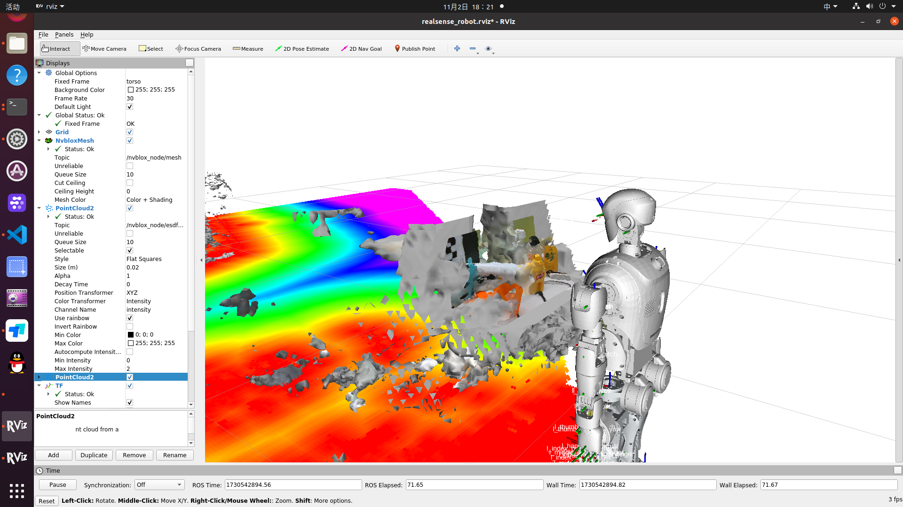
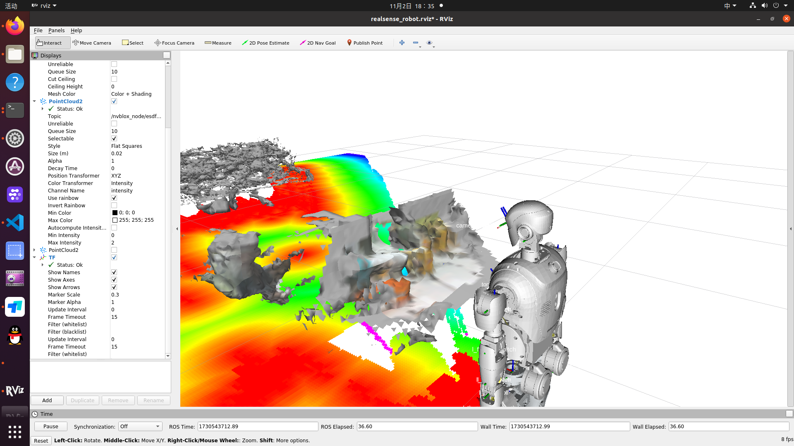

# nvblox_ros1_ws

* 此项目为nvblox的ros1调度版本，官方目前nvblox只支持ros2 humble的isaac_ros集成版本
* nvblox : 构造空间下的TSDF地图
* 开发环境建议搭配docker使用，该仓库搭配`nvblox:latest(大约10.8GB)`镜像，可直接运行

## 启动docker
```bash
cd /home/$USER/nvblox_ros1_ws/src/nvblox_ros1/docker
./run_docker.sh
```

## build your file into docker
```bash
catkin config --extend /opt/ros/noetic
catkin config --cmake-args -DCMAKE_BUILD_TYPE=Release
catkin build
```

## 命令使用指南
```bash
# 启动相机（docker里面没有，需要自行进行启动）
<!-- Launch realsense2_camera for head camera -->
<include file="$(find realsense2_camera)/launch/rs_camera.launch" >
    <arg name="camera" default="camera"/>
    <arg name="color_width"   value="640"/>
    <arg name="color_height"  value="480"/>
    <arg name="color_fps"     value="30"/>
    <arg name="depth_width"   value="848"/>
    <arg name="depth_height"  value="480"/>
    <arg name="depth_fps"     value="30"/>
    <arg name="enable_infra"        default="false"/>
    <arg name="enable_infra1"       default="false"/>
    <arg name="enable_infra2"       default="false"/>
    <arg name="enable_sync"   value="true"/>
    <arg name="align_depth"   value="true"/>
    <arg name="enable_pointcloud"   value="true"/>
</include>

# nvblox网格
roslaunch nvblox_ros nvblox_ros_realsense_d435.launch rviz:=true

# 调用服务
## 保存mesh模型
rosservice call /nvblox_node/save_ply nvblox_msgs/srv/FilePath "{file_path: '/root/nvblox_ws/src/nvblox_ros1/nvblox_ros/data/nvblox_realsense_map.ply'}"
## 保存tsdf/esdf地图
rosservice call /nvblox_node/save_map nvblox_msgs/srv/FilePath "{file_path: '/root/nvblox_ws/src/nvblox_ros1/nvblox_ros/data/nvblox_realsense_map.nvblx'}"
```

## TSDF建图效果

